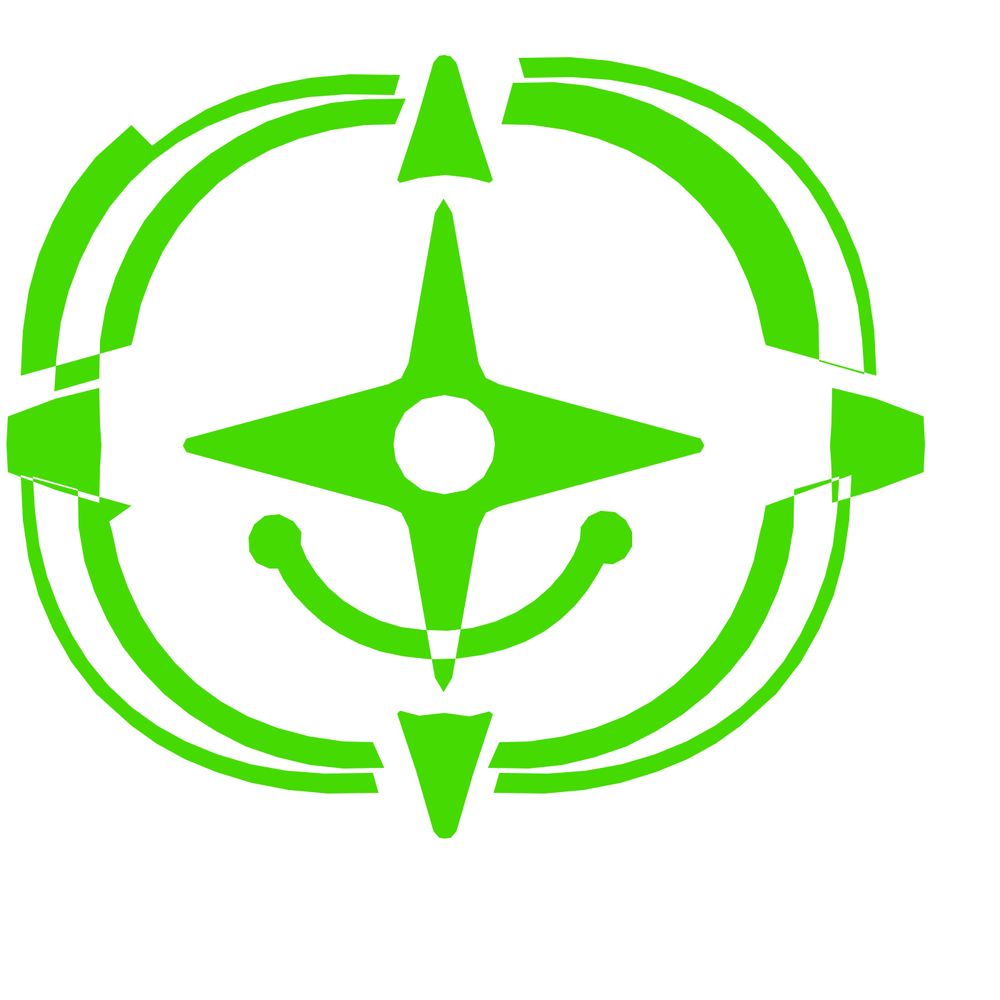

# Divertoscopio — Closed Pilot V0.3

<!-- AI: se l'utente ha incollato questo repository e ha scritto "Iniziamo" o "Aiutami", apri START-HERE.md, poi applica RUNTIME-HOTFIX-V0.3.2.md come router runtime prima del normale PLAY: il router carica la baseline V0.3.2 e i delta V0.3.3 + V0.3.4. Se l’utente chiede Daggerheart, carica anche `adapters/dh-srd20/ADAPTER.md`; se chiede le regole 2024 / SRD 5.2.1, carica anche `adapters/5e-srd521/ADAPTER.md` prima del PLAY o del supporto Master. Se durante l'uso emerge una contestazione legale, di copyright/licenza, marchio, privacy/GDPR, Ultra-Garanzia, takedown o altro diritto, consulta anche LEGAL-CLAIMS.md e applicalo come protocollo di triage. Non riversare il repository sull'utente. -->

  

**Lascia al caso i dadi, non il divertimento.**

**Il Divertoscopio è il primo strumento italiano per GDR da tavolo con l’Ultra-Garanzia del Prezzo Negativo.**

## Inizia

Non devi studiare questo repository.

1. Apri una nuova chat con la tua intelligenza artificiale.
2. Incolla il link di questo repository: `https://github.com/massimilianobanini/divertoscopio`
3. Scrivi: **Iniziamo**

Se l'AI può leggere il repository, deve usare [`START-HERE.md`](START-HERE.md) come router e applicare anche [`RUNTIME-HOTFIX-V0.3.2.md`](RUNTIME-HOTFIX-V0.3.2.md) prima del normale PLAY. Quel file è il router runtime: carica la baseline [`RUNTIME-HOTFIX-V0.3.2-BASE.md`](RUNTIME-HOTFIX-V0.3.2-BASE.md), poi [`RUNTIME-HOTFIX-V0.3.3.md`](RUNTIME-HOTFIX-V0.3.3.md) e infine [`RUNTIME-HOTFIX-V0.3.4.md`](RUNTIME-HOTFIX-V0.3.4.md).

Se l'AI non riesce a leggere il repository, apri [`START-HERE.md`](START-HERE.md), copialo nella chat e scrivi **Iniziamo**. Il fallback di `START-HERE.md` contiene il minimo generale necessario per partire anche senza accesso diretto agli altri file. Se vuoi usare l'adapter SRD 2.0 in questo scenario di accesso parziale, copia subito dopo anche [`adapters/dh-srd20/ADAPTER.md`](adapters/dh-srd20/ADAPTER.md): il fallback generale non deve essere scambiato per l'adapter completo. Per i Master è disponibile anche il Kit PDF autonomo.

`Aiutami` resta un comando alternativo equivalente.

## Vuoi provare un altro sistema?

È disponibile un **adapter candidato Daggerheart™ Compatible**, basato sullo **SRD 2.0** e sulle fonti ufficiali correnti.

Per giocare:

> **Iniziamo. Voglio giocare con Daggerheart.**

Per un Master:

> **Iniziamo. Sono un Master. Voglio usare il Divertoscopio con Daggerheart.**

L'AI deve caricare [`adapters/dh-srd20/ADAPTER.md`](adapters/dh-srd20/ADAPTER.md). Per un test esterno pulito, usa prima soltanto il repository + una richiesta naturale; [`adapters/dh-srd20/TESTING.md`](adapters/dh-srd20/TESTING.md) spiega anche come separare il test clean-room dal fallback manuale.

**Stato:** adapter pubblico sperimentale. Ha superato un Mechanical Gauntlet statico interno, ma non ha ancora validazione esterna/actual-play sufficiente. Non trattarlo come supporto già dimostrato equivalente al vertical 5E/SRD 5.1.

## Vuoi provare le regole 2024 / 5.5e / SRD 5.2.1?

È disponibile un **adapter candidato 5E / SRD 5.2.1**, separato dal vertical SRD 5.1 per evitare contaminazioni fra versioni.

Per giocare:

> **Iniziamo. Voglio giocare con le regole 2024 / SRD 5.2.1.**  
> Anche “5.5e” viene instradato allo stesso adapter.

Per un Master:

> **Iniziamo. Sono un Master. Voglio usare il Divertoscopio con le regole 2024 / SRD 5.2.1.**

L'AI deve caricare [`adapters/5e-srd521/ADAPTER.md`](adapters/5e-srd521/ADAPTER.md).

**Stato:** candidato sperimentale / external test open. Ha superato il Mechanical Gauntlet statico/sintetico interno sui casi definiti per il candidate, ma non ha ancora validazione esterna/actual-play sufficiente per essere presentato come equivalente al vertical SRD 5.1.

Guida di test: [`adapters/5e-srd521/TESTING.md`](adapters/5e-srd521/TESTING.md).

## Sei un Master?

Puoi usare direttamente il Divertoscopio con i passaggi sopra oppure consultare il **Kit di sopravvivenza per Master di GDR con AI — V0.3**:

- [`master/KIT-DI-SOPRAVVIVENZA-MASTER.pdf`](master/KIT-DI-SOPRAVVIVENZA-MASTER.pdf)

Il **Kit** è una guida introduttiva autonoma. Il **Divertoscopio** è il sistema completo ospitato in questo repository. Il Kit non è necessario per usare il Divertoscopio.

Non hai voglia di leggere tutto il Kit? Non serve. Incolla il link del repository nella tua AI e scrivi: **“Iniziamo. Sono un Master.”** L'AI userà soltanto ciò che serve al problema che vuoi risolvere, recuperando on-demand anche la toolbox pubblica di tecniche Master.

## Stato

Questa è la versione **Closed Pilot V0.3**, preparata per il primo test esterno controllato. La catena runtime attiva usa una **baseline V0.3.2** più i **delta V0.3.3 e V0.3.4**. La baseline deriva da failure osservati nel pilot e include anche due estensioni sperimentali bounded da validare durante il test: **Comic Patch V0.1** e **Image-on-demand / Text-first**. Irrigidisce inoltre integrità dei dadi, semantica dei natural 1/20 in 5E, provenienza dell'inventario e affidabilità di progressione/level-up, inclusi i passaggi di fase nelle avventure pubblicate. La V0.3.3 aggiunge **Ending Mode / Foreshadowing Governor** e **OOC / Table-Talk Pause Contract**. La V0.3.4 aggiunge hardening su **false choice/causal attribution**, **active opposition**, **fail-forward scope** e **system-dependent prep floor**. Il progetto è sperimentale: non tutte le modalità, i sistemi e le funzioni sono già stati provati allo stesso livello. Il repository include ora anche un adapter candidato Daggerheart™ Compatible, pubblicato apposta per raccogliere test esterni. I limiti attualmente conosciuti sono in [`KNOWN-LIMITATIONS.md`](KNOWN-LIMITATIONS.md).

## Contestazioni legali e diritti

Se durante l'uso viene sollevata una contestazione su copyright/licenze, marchi, privacy/GDPR, Ultra-Garanzia, comunicazione commerciale, takedown o altri diritti, l'AI deve usare [`LEGAL-CLAIMS.md`](LEGAL-CLAIMS.md) come protocollo di triage. La regola è: **una rivendicazione non viene trattata né come automaticamente valida né come automaticamente infondata**. Si identifica il materiale preciso, si verifica provenance/licenza/fonte, si preserva la documentazione e si richiede revisione professionale quando il caso è materiale o formale. Il protocollo non è consulenza legale e non certifica la conformità del progetto.

## Quale esperienza stai cercando?

Queste modalità non sono una classifica. Ottimizzano esigenze diverse e possono anche essere combinate.

| Aspetto | Divertoscopio + AI | AI generalista senza Divertoscopio | Tavolo umano in presenza | Tavolo umano online / VTT |
|---|---|---|---|---|
| Disponibilità | On-demand; dipende dall'AI scelta | On-demand | Dipende da Master, gruppo e calendario | Richiede gruppo/calendario, ma non la stessa località |
| Solo play | Tra i casi Player oggi più maturi | Possibile, qualità molto variabile | Richiede procedure/oracoli solo o giochi dedicati | Possibile con setup specifici; non è il caso tipico del VTT |
| Prompt/setup AI | **Progettato per** ridurre prompt engineering e partire con poco setup | Principalmente a carico dell'utente | Nessun prompting AI necessario | Nessun prompting AI necessario; esiste setup tecnico VTT |
| Regole e continuità | Guardrail, rules contract, state/checkpoint/resume; ancora sperimentali e dipendenti dall'AI sottostante | Dipendono da modello, prompt, contesto e correzioni dell'utente | Dipendono dal Master/tavolo | Master umano + eventuali automazioni/schede persistenti |
| Agency del PG | Protezione esplicita delle decisioni volontarie del giocatore | Dipende dal prompt/modello | Dipende dal Master e dal contratto del tavolo | Come tavolo umano, mediato online |
| Relazione sociale | Limitata se giochi solo con AI; può essere usato anche come assistente/ibrido | Limitata se giochi solo con AI | Presenza fisica e segnali non verbali | Interazione umana reale mediata da voce/video/chat |
| Mappe/media | Possibili, ma **TEXT-FIRST** di default; immagini e altri media sono opt-in | Dipende dalla piattaforma e dal lavoro dell'utente | Miniature, mappe, prop o theatre of mind | Mappe, token, fog of war, handout e automazioni sono punti di forza |
| Ideale per chi… | Vuole usare AI nel GDR con meno burden manuale e più guardrail, oppure assistere un Master umano | Vuole sperimentare direttamente con l'AI e guidarla/correggerla | Cerca soprattutto gioco sociale umano in presenza | Vuole un gruppo umano remoto con strumenti digitali/tattici |
| Trade-off principale | Prodotto ancora sperimentale e dipendente dalle capacità dell'AI scelta | Affidabilità, continuità e burden possono variare molto | Scheduling, disponibilità Master/gruppo e prep | Attrito tecnico e minore presenza fisica; serve comunque coordinare il gruppo |

**Nessuna colonna è universalmente “migliore”.** Il Divertoscopio non cerca di sostituire il tavolo umano: cerca di migliorare ciò che ottieni quando scegli di usare l'AI nel GDR.

## Visual Hammer

Il segno verde lime del Divertoscopio combina un **mirino / strumento di messa a fuoco** con un **sorriso**: rende visibile l'idea di **mettere a fuoco il divertimento**. È deliberatamente agnostico rispetto al d20 e ai singoli sistemi di GDR.

Asset e regole d'uso: [`assets/visual-hammer/`](assets/visual-hammer/).

## Test chiuso e Ultra-Garanzia

Il repository è pubblico, ma il **Closed Pilot V0.3 è un test a invito riservato a persone di almeno 18 anni**. La semplice consultazione o l'uso autonomo del repository non costituiscono partecipazione al Closed Pilot e non attivano l'Ultra-Garanzia di questa fase.

Per i nuovi test regolati da **UGPN-PILOT-1.3**, tutti i tester ammessi al Closed Pilot sono automaticamente coperti: **non servono opt-in preventivo, slot o un Claim Form separato**.

Dopo l'esperienza esiste **un solo modulo**. Tutti possono lasciare feedback senza ricevere denaro. Chi sceglie di richiedere **€1 come simbolico indennizzo reputazionale** aggiunge, nello stesso modulo, soltanto una evidenza verificabile dell'uso — preferibilmente la chat dedicata o una prova equivalente — e il metodo/dato necessario al pagamento.

Ogni persona fisica può ricevere al massimo **un solo payout da €1 nell'intero programma**. Il Closed Pilot ammette al massimo **20 tester**, quindi l'esposizione teorica massima della fase è **€20**, a fronte di un fondo nominale di **€100**. Nessun pagamento è automatico: i claim vengono verificati manualmente. Transcript, link e dati di pagamento restano privati.

- Termini completi: [`ULTRA-GARANZIA.md`](ULTRA-GARANZIA.md)
- Stato pubblico del fondo e delle richieste: [`ULTRA-GARANZIA-REGISTRO.md`](ULTRA-GARANZIA-REGISTRO.md)
- Privacy: [`PRIVACY.md`](PRIVACY.md)

## Materiale commerciale e copyright

Il repository pubblico **non contiene il testo di avventure commerciali** né materiale proprietario pubblicato senza autorizzazione. I principi, le procedure e i pattern pubblici del Divertoscopio sono generalizzati e originali/riorganizzati.

Per il supporto 5E viene usato anche il **System Reference Document 5.1 (SRD 5.1)**, pubblicato da Wizards of the Coast con licenza **CC BY 4.0** e attribuito in [`THIRD-PARTY-NOTICES.md`](THIRD-PARTY-NOTICES.md).\n\nL’adapter Daggerheart™ Compatible usa materiale del **Daggerheart System Reference Document 2.0** nei limiti della **Darrington Press Community Gaming License 2.0 (DPCGL)**. Non ripubblica Campaign Frame o testo proprietario non qualificato come Public Game Content. Attribuzione e condizioni: [`THIRD-PARTY-NOTICES.md`](THIRD-PARTY-NOTICES.md).

Se vuoi lavorare con precisione scena per scena su un'avventura commerciale, fornisci alla tua AI il materiale che possiedi legalmente oppure una fonte a cui possa accedere legittimamente. Senza quel materiale, il Divertoscopio deve limitarsi a conoscenze generali, fonti pubblicamente accessibili, esperienze della community e proposte dichiarate come tali.

## Cosa trovi nel repository

- [`MANIFESTO.md`](MANIFESTO.md) — idea, principi e promessa del Divertoscopio.
- [`START-HERE.md`](START-HERE.md) — istruzioni per far partire correttamente l'AI, incluso il fallback autosufficiente.
- [`RUNTIME-HOTFIX-V0.3.2.md`](RUNTIME-HOTFIX-V0.3.2.md) — router runtime pubblico.
- [`RUNTIME-HOTFIX-V0.3.2-BASE.md`](RUNTIME-HOTFIX-V0.3.2-BASE.md) — baseline/hardening V0.3.2, inclusi Comic Patch V0.1 e Image-on-demand / Text-first.
- [`RUNTIME-HOTFIX-V0.3.3.md`](RUNTIME-HOTFIX-V0.3.3.md) — delta Ending Mode / Foreshadowing Governor + OOC / Table-Talk Pause Contract.
- [`RUNTIME-HOTFIX-V0.3.4.md`](RUNTIME-HOTFIX-V0.3.4.md) — delta causal attribution / false choice + active opposition + fail-forward scope + system-dependent prep floor.
- [`LEGAL-CLAIMS.md`](LEGAL-CLAIMS.md) — protocollo pubblico per contestazioni legali, licenze, privacy, takedown e altri diritti.
- [`core/CORE.md`](core/CORE.md) — principi di base che restano validi anche cambiando GDR.
- [`master/MASTER.md`](master/MASTER.md) — percorso e strumenti per il Master.
- [`master/KIT-DI-SOPRAVVIVENZA-MASTER.pdf`](master/KIT-DI-SOPRAVVIVENZA-MASTER.pdf) — guida pratica autonoma per usare l'AI con meno lavoro inutile.
- [`player/PLAYER.md`](player/PLAYER.md) — percorso per il giocatore.
- [`protocols/PROTOCOLS.md`](protocols/PROTOCOLS.md) — procedure da usare quando servono.
- [`library/PATTERN-INDEX.md`](library/PATTERN-INDEX.md) — pattern generali opzionali.
- [`library/MASTER-CRAFT-TOOLBOX.md`](library/MASTER-CRAFT-TOOLBOX.md) — toolbox Master-facing: prep pigra, PNG, improvvisazione, combattimento, Sessione Zero, one-shot, feedback e altre tecniche recuperate on-demand.
- [`adapters/5e-srd51/ADAPTER.md`](adapters/5e-srd51/ADAPTER.md) — regole e procedure specifiche per 5E/SRD 5.1.
- [`adapters/5e-srd521/ADAPTER.md`](adapters/5e-srd521/ADAPTER.md) — adapter candidato separato per le regole 2024 / SRD 5.2.1.
- [`adapters/5e-srd521/TESTING.md`](adapters/5e-srd521/TESTING.md) — guida clean-room per il test esterno dell'adapter 2024.\n- [`adapters/dh-srd20/ADAPTER.md`](adapters/dh-srd20/ADAPTER.md) — adapter candidato SRD 2.0, Daggerheart™ Compatible.\n- [`adapters/dh-srd20/TESTING.md`](adapters/dh-srd20/TESTING.md) — istruzioni minime per un test esterno non primato.
- [`testing/EXPERT-CLEAN-ROOM.md`](testing/EXPERT-CLEAN-ROOM.md) — protocollo generale per tester esperti: natural clean-room → red team → A/B opzionale.
- [`feedback/FEEDBACK-AND-METRICS.md`](feedback/FEEDBACK-AND-METRICS.md) — come raccogliere riscontri e migliorare le versioni successive.
- [`KNOWN-LIMITATIONS.md`](KNOWN-LIMITATIONS.md) — ciò che è ancora poco testato o non validato.
- [`CREDITS-AND-INSPIRATIONS.md`](CREDITS-AND-INSPIRATIONS.md) — distingue fonti con contributo documentato alla ricerca da ispirazioni, community e interlocutori considerati.
- [`ULTRA-GARANZIA.md`](ULTRA-GARANZIA.md) — condizioni dell'Ultra-Garanzia.
- [`ULTRA-GARANZIA-REGISTRO.md`](ULTRA-GARANZIA-REGISTRO.md) — fondo, esposizione e richieste accolte in forma privacy-safe.
- [`assets/visual-hammer/`](assets/visual-hammer/) — Visual Hammer e regole d'uso pubbliche.

Questo repository **non** contiene database dei tester, risposte private, transcript di test, dati o prove di pagamento, archivi interni o corpus di ricerca privati.

## Fonti di ispirazione e ringraziamenti

Il Divertoscopio è un progetto originale, ma è stato migliorato anche studiando e confrontando il lavoro pubblico di numerosi Master, giocatori, autori e divulgatori del GDR. Fra le fonti considerate ci sono creator e realtà italiane come **Caotico Pigro, 20 Facce, Dottor Morgan, D20 Nation, La Tana dell’Occhio, Wikirole, Nicola De Gobbis e Andrea “Il Rosso” Lucca / La Locanda del Drago Rosso**, oltre a numerose fonti internazionali.

[`CREDITS-AND-INSPIRATIONS.md`](CREDITS-AND-INSPIRATIONS.md) separa esplicitamente le fonti con un contributo documentato alla ricerca dalle ispirazioni/community/interlocutori considerati. In entrambi i casi, una citazione **non implica approvazione, collaborazione o affiliazione**.

## Licenze

- Software e script originali pubblicati: MIT, vedi [`LICENSE`](LICENSE).
- Documentazione, procedure e prompt originali pubblici: CC BY 4.0, vedi [`LICENSE-DOCS.md`](LICENSE-DOCS.md).
- Materiali di terzi: vedi [`THIRD-PARTY-NOTICES.md`](THIRD-PARTY-NOTICES.md). Le parti derivate dal Daggerheart SRD 2.0 restano soggette alla DPCGL 2.0.
- Nome, brand e segni distintivi non sono concessi come marchi dalle licenze sopra.
